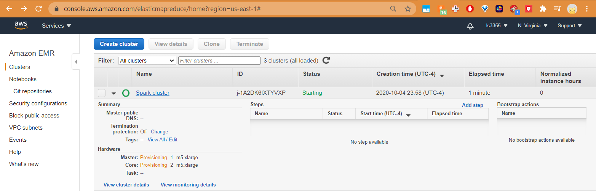

## Spark Setup on AWS EMR

<a href="https://www.youtube.com/watch?v=ZVdAEMGDFdo"></a>
### Steps

#### On AWS Console
- IAM: set up secret access key if does not exist
- EC2: create a key pair named spark-cluster
- EMR: create cluster called spark-udacity

#### On Command Line
- pip install awscli if not installed
- create .aws folder if it doesn't exist
- create credentials and configuration files to store Access Key ID and Secret Access key as well as defaults of region. 


#### Create Spark Cluster
```
aws emr create-cluster --name "Spark cluster" --release-label emr-5.30.1 --applications Name=Spark \
--ec2-attributes KeyName=spark-cluster --instance-type m5.xlarge --instance-count 3 --use-default-roles
```

#### EMR > Notebooks > Create Notebook
- first insert these permissions into the S3 bucket policy

S3 bucket `aws-emr-resources-<my-IAM>-us-east-1`

```
{
    "Version": "2012-10-17",
    "Statement": [
        {
            "Effect": "Allow",
            "Principal": {
                "AWS": "arn:aws:iam::<my-IAM>:role/EMR_DefaultRole"
            },
            "Action": [
                "s3:ListBucket"
            ],
            "Resource": [
                "arn:aws:s3:::aws-emr-resources-<my-IAM>-us-east-1"
            ]
        },
        {
            "Effect": "Allow",
            "Principal": {
                "AWS": "arn:aws:iam::<my-IAM>:role/EMR_DefaultRole"
            },
            "Action": [
                "s3:PutObject",
                "s3:GetObject",
                "s3:DeleteObject"
            ],
            "Resource": [
                "arn:aws:s3:::aws-emr-resources-<my-IAM>-us-east-1/*"
            ]
        }
    ]
}
```
